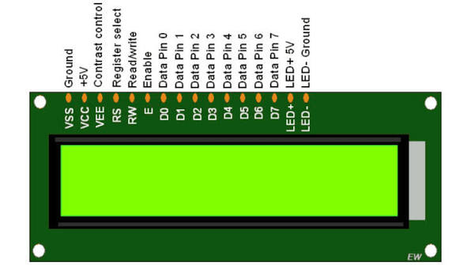
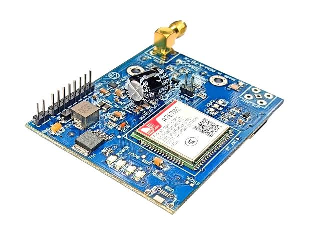

# 🔐 SecureEntry OTP : GSM-Based Two-Step Time-Limited Door Access System

> **An embedded security system built around the LPC214x/LPC21xx ARM7
> microcontroller, combining user authentication, time-limited OTP
> verification, GSM SMS communication, EEPROM-based data storage, and
> automatic door control.**

SecureEntry is designed to provide an additional layer of security
beyond a normal password.

A registered user first authenticates with a **User ID + Password**.
After successful password authentication, the system generates a
**6-digit OTP**, sends it to the user's registered mobile number through
a GSM module, and allows access only when the correct OTP is entered
within **60 seconds**.

After successful verification, the system automatically opens the door
using a **DC motor + L293D**, keeps the door open for a defined period,
and then closes it automatically.

------------------------------------------------------------------------

## ✨ Key Features

-   🔑 **User ID + Password authentication**
-   🔢 **6-digit time-limited OTP**
-   📱 **GSM-based OTP delivery through SMS**
-   ⏱️ **60-second OTP validity**
-   🚫 **Password failure protection**
-   ⏳ **Temporary password blocking after repeated failures**
-   📩 **SMS-based BLOCK / UNBLOCK commands**
-   💾 **25LC512 SPI EEPROM for persistent user data**
-   🕒 **RTC-based time and date handling**
-   🚪 **Automatic door opening and closing**
-   ⚙️ **L293D DC motor control**
-   🖥️ **16×2 LCD user interface**
-   ⌨️ **4×4 matrix keypad**
-   🔔 **External interrupt for user-management mode**
-   🧩 **Custom LCD CGRAM icons for door status**
-   📡 **GSM diagnostics for module, SIM, network and signal status**
-   🛡️ **Modular C source code for easier maintenance**

------------------------------------------------------------------------

## 🎯 Project Objective

The main objective of SecureEntry is to build a practical electronic
door-access system where a password alone is not sufficient for entry.

The system uses two authentication stages:

``` text
        USER
         │
         ▼
   Enter User ID
         │
         ▼
   Enter Password
         │
         ▼
   Password Valid?
      │       │
     NO      YES
      │       │
      ▼       ▼
   Security   Generate OTP
    Check         │
                  ▼
          Send OTP through GSM
                  │
                  ▼
               Enter OTP
                  │
                  ▼
          OTP valid & < 60 sec?
            │             │
            NO           YES
            │             │
            ▼             ▼
      Access Denied    Door Opens
                           │
                           ▼
                    Door remains open
                           │
                           ▼
                       Door Closes
```

This provides a simple **two-step authentication mechanism** suitable
for an embedded access-control demonstration.

------------------------------------------------------------------------

## 🏗️ System Architecture

<p align="center">
  
</p>
------------------------------------------------------------------------

## 🔐 Authentication Flow

### Step 1 - User Authentication

The user enters:

1.  User ID
2.  Password

The controller checks the stored information in EEPROM.

If the password is incorrect repeatedly, the security mechanism
temporarily blocks further password attempts.

### Step 2 - OTP Authentication

After successful password authentication:

1.  A 6-digit OTP is generated.
2.  The OTP is associated with the current RTC date/time.
3.  The OTP is sent to the registered mobile number using GSM.
4.  The user enters the OTP using the keypad.
5.  The OTP must be verified before its 60-second validity period
    expires.

### Step 3 - Door Access

If the OTP is correct and still valid:

``` text
OTP VERIFIED
     ↓
DOOR OPENING
     ↓
Door motor rotates
     ↓
Door remains open
     ↓
DOOR CLOSING
     ↓
Door motor rotates in reverse
     ↓
Door closed
```

------------------------------------------------------------------------

## 📱 GSM SMS Security

The GSM module is used for both outgoing and incoming SMS functionality.

### OTP SMS

The system sends the generated OTP to the registered user's mobile
number.

The SMS contains information such as:

-   OTP
-   User ID
-   Current date/time
-   OTP validity
-   Security instruction

### Remote BLOCK / UNBLOCK

The GSM driver also checks incoming SMS commands.

Supported command format:

``` text
BLOCK <USER_ID>
UNBLOCK <USER_ID>
```

The system verifies that the sender is registered for the requested user
before applying the corresponding operation.

This provides an additional remote security mechanism.

------------------------------------------------------------------------

## ⏱️ OTP Protection

The OTP module is implemented separately in:

``` text
otp.c
otp.h
```

### OTP characteristics

  Property            Implementation
  ------------------- ----------------
  OTP length          6 digits
  Minimum value       100000
  Maximum value       999999
  Validity            60 seconds
  Time source         RTC
  Date handling       Included
  Midnight handling   Supported

The OTP expiration calculation uses both the generated date and time,
allowing the validity check to continue correctly even if the 60-second
window crosses midnight.

------------------------------------------------------------------------

## 🚫 Login Security

The user-management module maintains security information in EEPROM.

The project includes:

-   Failed password attempt counter
-   Temporary password blocking
-   User active/inactive status
-   Block expiry information
-   Remote SMS block/unblock support

The configured password protection uses:

``` text
Maximum password attempts : 3
Temporary block time      : 120 seconds
```

These values are defined in `user.c` and can be modified according to
project requirements.

------------------------------------------------------------------------

## 💾 EEPROM Data Storage

The project uses a **25LC512 SPI EEPROM** for persistent storage.

EEPROM is used for information such as:

-   User IDs
-   User passwords
-   User status
-   Failed password count
-   Block expiry information
-   Registered mobile numbers
-   Administrative information
-   Initialization markers

Using EEPROM allows important user/security information to remain
available across controller resets and power cycles, subject to the
system's RTC/time source.

------------------------------------------------------------------------

## 🕒 RTC

The RTC module provides:

-   Hours
-   Minutes
-   Seconds
-   Date
-   Month
-   Year
-   Day information

RTC data is used by the OTP system and password-block timing logic.

The final application initializes the RTC with a starting date/time in
`main.c`. For deployment, this initialization can be replaced with the
required current time/date source.

------------------------------------------------------------------------

## 🚪 Automatic Door Control

The door-control module is implemented in:

``` text
door.c
door.h
```

The system controls a DC motor through an **L293D motor driver**.

### Door sequence

``` text
Successful OTP
      ↓
Door_Open()
      ↓
Motor runs in opening direction
      ↓
Motor stops
      ↓
Door remains open
      ↓
Door_Close()
      ↓
Motor runs in closing direction
      ↓
Motor stops
```

Current source configuration:

``` text
Motor movement time : 2 seconds
Door open time      : 10 seconds
```

These timings are configurable in `door.c`.

------------------------------------------------------------------------

## 🖥️ LCD Door Indicators

The project includes custom LCD CGRAM characters in:

``` text
door_cgram.c
door_cgram.h
```

Two custom characters represent:

-   🚪 Door opening/open state
-   🚪 Door closing/closed state

Example display:

``` text
🚪 DOOR OPENING...
```

and

``` text
🚪 DOOR CLOSING...
```

The custom characters are stored in LCD CGRAM during initialization.

------------------------------------------------------------------------

## ⌨️ 4×4 Keypad

The keypad is used for:

-   User ID entry
-   Password entry
-   OTP entry
-   User management
-   Menu navigation

The keypad supports:

  Key     Function
  ------- ---------------
  `0–9`   Numeric input
  `B`     Backspace
  `C`     Clear
  `D`     Enter
  `*`     Previous
  `#`     Next

------------------------------------------------------------------------

## 👨‍💼 User Management

An external interrupt is used to enter the user-management section.

The management functionality in `user.c` includes operations such as:

-   Add user
-   Modify user
-   Delete user
-   Block/unblock user
-   View users
-   Change administrator password

The external interrupt is handled through:

``` text
eint.c
eint.h
```

The interrupt service routine only sets a flag, while the actual menu
processing is performed safely in the main application loop.

------------------------------------------------------------------------

## 🔄 Complete System Workflow

<p align="center">
  
</p>


------------------------------------------------------------------------

## 🔌 Hardware Components

  Component                  Purpose
  -------------------------- -----------------------------
  LPC214x/LPC21xx ARM7 MCU   Main controller
  16×2 LCD                   User interface
  4×4 Matrix Keypad          User input
  GSM Module                 OTP SMS and remote commands
  25LC512 SPI EEPROM         Persistent data storage
  RTC                        Time/date source
  L293D                      DC motor driver
  DC Motor                   Door movement
  External switch            User-management interrupt
  Power supply               Circuit power

------------------------------------------------------------------------

## 📌 Main Interface Connections

The pin assignments below are taken from the project source files.

### LCD

  
</p>

``` text
LCD Data : P0.6 – P0.13
LCD RS   : P0.16
LCD EN   : P0.18
LCD RW   : P0.17
```

### 4×4 Keypad


</p>

``` text
Rows : P1.16 – P1.19
Cols : P1.20 – P1.23
```

### SPI EEPROM


</p>

``` text
SPI0 SCK  : P0.4
SPI0 MISO : P0.5
SPI0 MOSI : P0.6
CS        : P0.7
```

### GSM / UART0


</p>

``` text
TXD0 : P0.0
RXD0 : P0.1
```

### External Interrupt


</p>

``` text
EINT1 : P0.3
VIC channel : 15
```

### Door Motor Driver


</p>

``` text
Motor IN1 : P0.20
Motor IN2 : P0.21
```

> **Note:** Pin multiplexing should be checked against the exact Proteus
> schematic/target-board configuration when reproducing the project,
> because several LPC21xx peripherals use configurable pin functions.

------------------------------------------------------------------------

## 📂 Project Structure

A typical project structure is:

```text
SecureEntry-OTP-GSM-Based-Two-Step-Time-Limited-Door-Access-System/
│
├── 📁 Header Files/
│   ├── defines.h
│   ├── delay.h
│   ├── door.h
│   ├── door_cgram.h
│   ├── eint1.h
│   ├── gsm.h
│   ├── kpm.h
│   ├── kpm_defines.h
│   ├── lcd.h
│   ├── lcd_defines.h
│   ├── otp.h
│   ├── rtc.h
│   ├── spi.h
│   ├── spi_defines.h
│   ├── spi_eeprom.h
│   ├── spi_eeprom_defines.h
│   ├── switch.h
│   ├── types.h
│   ├── uart.h
│   ├── uart_defines.h
│   └── user.h
│
├── 📁 Hex File/
│   └── SecureEntry OTP GSM Based Two-Step Time-Limited Door Access System.hex
│
├── 📁 Keil Project File/
│   └── SecureEntry OTP GSM Based Two-Step Time-Limited Door Access System.uvproj
│
├── 📁 Pictures/
│   ├── GSM.jpeg
│   ├── Keypad.png
│   ├── L293D Motor Driver.jpeg
│   ├── LCD.jpeg
│   ├── Outputs On LCD 1.jpeg
│   ├── Outputs On LCD 2.jpeg
│   ├── SPI EEPROM.jpeg
│   ├── Switch.jpeg
│   ├── System Architecture.png
│   └── System WorkFlow.png
│
├── 📁 Setup and Installation Steps/
│   └── Setup and Installation Steps.pdf
│ 
├── 📁 Source Files/
│   ├── delay.c
│   ├── door.c
│   ├── door_cgram.c
│   ├── eint1.c
│   ├── gsm.c
│   ├── kpm.c
│   ├── lcd.c
│   ├── main.c
│   ├── otp.c
│   ├── rtc.c
│   ├── spi.c
│   ├── spi_eeprom.c
│   ├── switch.c
│   ├── uart.c
│   └── user.c
│
└── README.md
 
```

------------------------------------------------------------------------

## 🧩 Software Modules

The project is divided into independent modules so that each major
hardware/function block can be developed and tested separately.

  Module           Responsibility
  ---------------- -------------------------------------------------
  `main.c`         System initialization and main application loop
  `user.c`         Authentication and user management
  `otp.c`          OTP generation and verification
  `gsm.c`          GSM communication and SMS handling
  `door.c`         Motor-based door movement
  `door_cgram.c`   Custom LCD door icons
  `rtc.c`          RTC configuration and date/time
  `spi.c`          SPI0 driver
  `spi_eeprom.c`   25LC512 EEPROM interface
  `lcd.c`          LCD driver
  `Keypad.c`       4×4 keypad driver
  `uart.c`         UART0 communication
  `eint.c`         External interrupt handling
  `switch.c`       User-management switch interface
  `delay.h`        Delay routines
  `types.h`        Project data types

------------------------------------------------------------------------

## 🛠️ Development Environment

The project is intended for an ARM7 embedded-development workflow.

### Recommended tools

-   **Keil µVision** --- C compilation and firmware development
-   **Proteus** --- Circuit simulation
-   **LPC21xx/LPC214x ARM7 target**
-   GSM module supporting AT commands and SMS
-   25LC512 SPI EEPROM
-   L293D motor driver
-   DC motor
-   16×2 LCD
-   4×4 keypad

------------------------------------------------------------------------

## ▶️ How to Use

### 1. Open the firmware project

Open the project in your ARM7 development environment, such as Keil
µVision.

### 2. Add the source files

Make sure all `.c` and `.h` files from this repository are included in
the project.

### 3. Configure the hardware

Connect the peripherals according to the project schematic and
source-level pin definitions.

### 4. Configure the GSM module

Insert a working SIM card into the GSM module and connect it to UART0.

The GSM module should be able to:

-   Respond to AT commands
-   Detect the SIM
-   Register on the network
-   Send SMS
-   Receive SMS

### 5. Program / simulate the controller

Build the project and load the generated firmware into the target MCU or
Proteus simulation.

### 6. Test login

Enter a registered User ID and password.

After successful authentication, the system generates and sends an OTP.

### 7. Enter the OTP

Enter the OTP received through SMS before the 60-second validity period
expires.

### 8. Test door operation

A successful OTP verification starts the automatic door sequence.

------------------------------------------------------------------------

## 🧪 Proteus Testing

The project can be demonstrated in a Proteus-based environment using the
required peripherals.

A typical demonstration should show:

``` text
System Startup
     ↓
GSM Initialization
     ↓
Network Status
     ↓
User Login
     ↓
OTP Generation
     ↓
SMS Transmission
     ↓
OTP Verification
     ↓
Door Opening
     ↓
Door Open Delay
     ↓
Door Closing
```

------------------------------------------------------------------------

## 🧠 Why This Project Is Useful

SecureEntry demonstrates how multiple embedded technologies can be
combined into one practical application:

``` text
Microcontroller
      +
Authentication
      +
OTP Security
      +
GSM Communication
      +
EEPROM Storage
      +
RTC Timing
      +
Motor Control
      =
Secure Embedded Door Access
```

It is also a useful learning project for understanding:

-   Embedded C
-   ARM7 microcontrollers
-   GPIO
-   UART
-   SPI
-   EEPROM
-   RTC
-   External interrupts
-   GSM AT commands
-   SMS processing
-   Keypad interfacing
-   LCD interfacing
-   Motor control
-   Embedded security concepts

------------------------------------------------------------------------

## 🔒 Security Notes

This project is an educational embedded-security implementation.

For a production access-control system, additional protections should be
considered, such as:

-   Cryptographically secure OTP generation
-   Encrypted credential storage
-   Secure key management
-   Hardware tamper detection
-   Secure boot
-   Watchdog supervision
-   Better physical door-position sensing
-   Independent safety controls for the motor
-   Protected administrator credentials
-   Robust GSM/SMS spoofing protection

The current project is intended primarily for **academic learning,
demonstration, and embedded-system development**.

------------------------------------------------------------------------

### LCD OUTPUTS


## 📍 Applications

SecureEntry can be adapted for different environments where controlled and time-limited access is required.

### 🏠 Residential Door Security
- Two-step authentication using User ID, Password, and OTP.
- OTP is sent to the registered mobile number.
- Automatic door opening after successful authentication.

### 🏢 Office & Workplace Access
- Controlled access to offices, cabins, laboratories, and restricted rooms.
- User accounts can be added, modified, blocked, or unblocked.

### 🧪 Laboratories & Educational Institutions
- Suitable for restricting access to electronics, computer, communication, and research laboratories.
- Demonstrates practical ARM7, GSM, EEPROM, RTC, keypad, LCD, and motor-control technologies.

### 🗄️ Server Rooms & Restricted Areas
- Provides an additional authentication layer for restricted areas.
- Temporary OTP verification helps control access.

### 🏭 Industrial Access Control
- Can be adapted for control rooms, machinery rooms, storage areas, and other restricted locations.
- The DC motor interface can be adapted to an appropriate door actuator.

### 📱 Remote User Blocking
- Administrators can remotely block or unblock registered users through SMS.
- Supported commands:
  - `BLOCK <USER_ID>`
  - `UNBLOCK <USER_ID>`

### 🎓 Embedded-System Demonstration
This project is also useful for demonstrating:

- ARM7 microcontroller programming
- Embedded C
- Two-step authentication
- OTP-based access control
- GSM/SMS communication
- SPI EEPROM
- RTC-based timing
- LCD and keypad interfacing
- External interrupts
- L293D and DC motor control


## 🚀 Future Improvements

Possible extensions include:

-   📷 Camera-based verification
-   🪪 RFID authentication
-   🔵 Bluetooth/mobile-app control
-   🌐 IoT/cloud monitoring
-   🔔 Door-open alarm
-   🚨 Tamper detection
-   🔋 Battery backup
-   🔐 Stronger cryptographic OTP generation
-   📊 Access-log storage
-   📱 Smartphone notification support
-   🧭 Door-position sensors
-   🛡️ Multi-level administrator roles

------------------------------------------------------------------------

## 📜 License

This project is intended for educational and demonstration purposes.

You may adapt the source code for learning and further development. If
you publish a modified version, clearly document your changes and retain
appropriate attribution to the original project.

------------------------------------------------------------------------

## 👨‍💻 Author

**Shaik Khadar Basha**

**Project:** SecureEntry : GSM-Based Two-Step Time-Limited Door Access
System

**Domain:** Embedded Systems / ARM7 / Embedded C

------------------------------------------------------------------------

## ⭐ Support the Project

If this project helped you understand embedded security, GSM, OTP
authentication, or ARM7 development, consider giving the repository a ⭐
on GitHub.

**Thank you for checking out SecureEntry! 🔐🚪**
